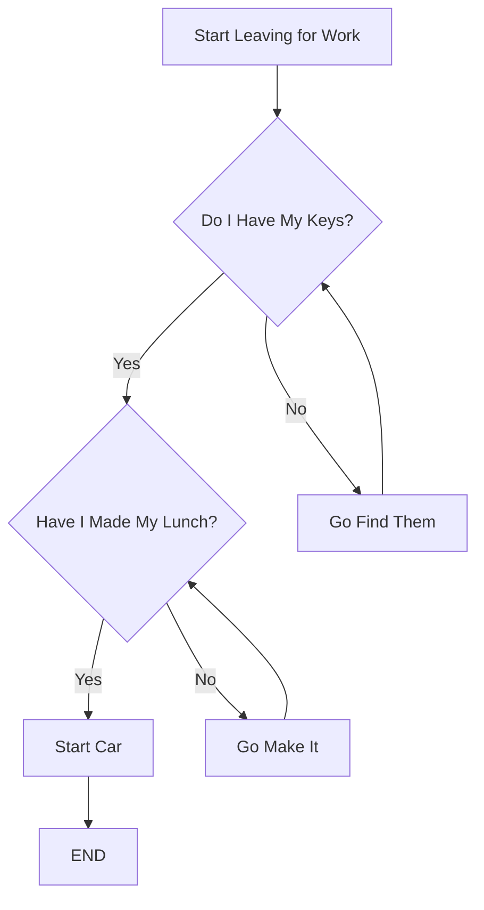

# Diagram.md

```mermaid
flowchart TD
A[Start Leaving for Work] --> B{Do I Have My Keys?}
B -- Yes --> C{Have I Made My Lunch?}
C -- Yes --> D[Start Car]
D --> X[END]
B -- No --> F[Go Find Them]
F --> B
C -- No --> E[Go Make It]
E --> C
```
